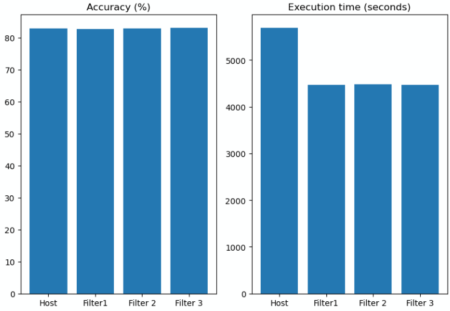

# CSC14120 – PARALLEL PROGRAMMING: FINAL PROJECT

Group ID: 12

| Họ và tên  | Nguyễn Trương Hoàng Thái  | Trần Quốc Đạt  |
|---|---|---|
| MSSV  | 20127625  | 20127134  |

## mini-dnn-cpp
**mini-dnn-cpp** là phần cài đặt mạng neuron học sâu, được triển khai hoàn toàn bằng C++. Phần phụ thuộc duy nhất được tác giả sử dụng là Eigen và chỉ dùng làm phần header.

Cài đặt nguồn: [mini-dnn-cpp](https://github.com/iamhankai/mini-dnn-cpp.git)

## Cài đặt và sử dụng
* Video trình bày: [YouTube video](https://youtu.be/xfXmyO7JHN0)
* Mô hình của đồ án được thực thi với `GPU Tesla T4 7.5` của `Google Colab`. Các cấu hình và kết quả kiểm thử được lưu trữ tại file [notebook](https://colab.research.google.com/drive/1H_2zqUGyKyxCmVCGe7rlknMv2mEp3P6c?usp=sharing).
* Cmake đã được cấu hình để có thể biên dịch và thực thi với cả hai phiên bản là host (thực thi tuần tự) và device (thực thi song song) cho quá trình nhân tích chập.
* Với phiên bản device, hiện tại đã có 3 phiên bản filter là filter1, filter2, filter3. Để lựa chọn phiên bản thực thi, truyền vào một trong các tham số 0, 1, 2,... tương ứng với host, filter1, filter 2 ... filter k. Ví dụ `./demo 0 ` = phiên bản host; `./demo 1 ` = phiên bản filter 1.

## Mô tả bài toán
### Input
* Dữ liệu được sử dụng cho đồ án này là tập dữ liệu [Fashion-MNIST](https://github.com/zalandoresearch/fashion-mnist.git). Fashion-MNIST là bộ dữ liệu gồm 60000 bức ảnh ở tập huấn luyện và 10000 bức ảnh ở tập kiểm thử, tất cả đều là ảnh trắng đen (1 kênh màu). Mỗi bức ảnh ở tập dữ liệu này có kích thước 28x28 pixel và được phân loại bởi 10 lớp khác nhau.
* Fashion-MNIST có cấu trúc tương tự tập dữ liệu gốc là [MNIST](http://yann.lecun.com/exdb/mnist/). Mục đích của bộ dữ liệu Fashion-MNIST là giúp giảm thiểu tình trạng overfitting của các mô hình học máy đối với bộ dữ liệu gốc là MNIST, từ đó đem lại quá trình đánh giá chính xác hơn.
* Ở đồ án này, dữ liệu được cấu trúc và xử lý bởi Eigen `Matrix` theo ma trận cột, trong đó mỗi cột là một ảnh và 28x28 dòng cho mỗi pixel của ảnh tương ứng. Các tầng khác nhau có phương thức foward tương ứng với hành vi của tầng để xử lý dữ liệu đầu vào.

### Output
* Kết quả đầu ra của mô hình mini-dnn-cpp là kết quả phân lớp của dữ liệu đầu vào tương ứng. Nhãn kết quả dự đoán được so sánh với nhãn đúng để tính toán độ chính xác của mô hình. 
* Ở hai tầng convolution C1 và C3, kết quả đầu ra có cấu trúc giống với dữ liệu đầu vào (Eigen `Matrix` theo ma trận cột, mỗi cột là một ảnh và mỗi dòng là một pixel tương ứng) nhưng số lượng dòng của ma trận là bội số theo channel đầu ra (số lượng filter).

### Ứng dụng của đồ án
* Toàn bộ dự án là một mạng CNN (Convolutional Neural Network) với các tầng convolution, max pooling, dense layer và các tầng kích hoạt đem lại khả năng nhận dạng và phân lớp những bức ảnh đầu vào. Các pixel của một bức ảnh được lưu trữ bởi thư viện Eigen và được xử lý bởi mô hình để đạt được nhãn dự đoán thích hợp.

### Tăng tốc khả năng xử lý của mô hình
* Ở phiên bản mặc định, quá trình nhân tích chập ở các tầng convolution (C1, C3) được thực hiện tuần tự cho từng bức ảnh bởi CPU. Điều này không ảnh hưởng đến kết quả phân lớp của mô hình nhưng thời gian thực thi là không hề nhỏ.
* Ý tưởng tăng tốc cho mô hình là song song hóa quá trình nhân tích chập ở hai tầng C1 và C3. Việc nhân tích chập cho mỗi bức ảnh sẽ diễn ra đồng thời và được thực thi bởi GPU, giúp cải thiện đáng kể thời gian thực thi của mô hình.

## So sánh các phiên bản
| Phiên bản nhân tích chập  | Độ chính xác (%)  | Thời gian thực thi (giây)  |
|---|---|---|
| Host  | 82.97 | 5687  |
| Filter 1  | 82.77  | 4463  |
| Filter 2  | 82.82  | 4484  |
| Filter 3  | 83.05  | 4472  |

## Cấu trúc mã nguồn của tác giả
THƯ MỤC:
* src
  * layer: cài đặt các tầng convolution, pooling, hàm kích hoạt dựa trên interface ở file layer.h.
  * loss: cài đặt hàm đo độ lỗi (cross entropy, mse).
  * optimizer: cài đặt stochastic gradient descent.

* data: chứa bộ dữ liệu Fashion-MNIST.
* third_party: chứa thư viện eigen hỗ trợ tính toán đại số.

TẬP TIN (đa số ở thư mục src):
* mnist: đọc tập dữ liệu mnist. Dữ liệu sẽ được xử lý theo cột: mỗi cột sẽ tương ứng với một ảnh trắng đen (một kênh màu) gồm 28x28 dòng thể hiện cho mỗi pixel.

* layer.h: cài đặt interface cho các tầng convolution, pooling.

* network: cấu tạo của mô hình, chứa các layer và hoạt động của mỗi layer.

* demo.cc: tập tin chính của chương trình, gồm cấu trúc và quá trình huấn luyện mô hình.

MỘT VÀI BIẾN SỐ CỦA CHƯƠNG TRÌNH:
* channel: số kênh của dữ liệu. Nếu tầng convolution có channel_out=3 nghĩa là có 3 neuron (tương ứng 3 kernel) ở tầng này.

* dim (với các tầng khác dense): số lượng pixel của ảnh, có giá trị bằng height x width x channel.

* dim (với dense layer): số lượng neuron của tầng.

* Quá trình nhân tích chập và pooling sẽ làm tròn phần tử lên với trường hợp dữ liệu có số lượng lẻ. Kết quả cuối cùng phụ thuộc vào nhiều yếu tố như stride, padding...

*Thư mục `Report` chứa file báo cáo (.ipynb) trình bày quá trình thực hiện, phân tích mô hình, cài đặt thuật toán... và các tài liệu liên quan.*

## Nguồn tham khảo
[1] BASE MODEL: mini-dnn-cpp
* https://github.com/iamhankai/mini-dnn-cpp.git

[2] DATASET: fashion MNIST
* https://github.com/zalandoresearch/fashion-mnist

[3] RELATED KNOWLEDGE: CNN + LeNet-5
* https://www.kaggle.com/code/blurredmachine/lenet-architecture-a-complete-guide/notebook
* https://setosa.io/ev/image-kernels/
* https://poloclub.github.io/cnn-explainer/
* https://www.tensorflow.org/

[4] Convert Eigen Matrix to C array
* https://stackoverflow.com/questions/8443102/convert-eigen-matrix-to-c-array
* [How to work with Eigen in CUDA kernels](https://stackoverflow.com/questions/23802209/how-to-work-with-eigen-in-cuda-kernels)

[5] [Book](https://rd.yyrcd.com/Books/2022-03-15-Programming%20Massively%20Parallel%20Processors%203rd%20Edition.pdf): Programming Massively Parallel Processors (Third Edition)
* Chapter 16 (slide 362): CONVOLUTIONAL LAYER: A BASIC CUDA IMPLEMENTATION OF FORWARD PROPAGATION

[6] Lab 1 & Lab 3 of course assignment.

