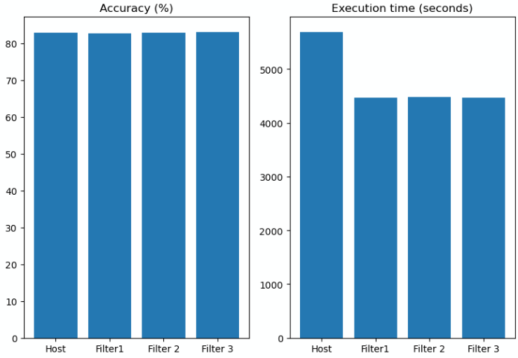

# Optimizing the Forward Pass of Convolutional Neural Network
This repository is submission for the final project of **Parallel programming CSC14120** course. The work started from Nov. 2023 to Jan. 2024.

| Name  | ID |
|---|---|
| Nguyễn Trương Hoàng Thái  | 20127625  |
| Trần Quốc Đạt | 20127134  |

# Introduction
In this project, I will **implement and optimize** the **forward-pass** of **convolutional layer** (C1 and C3 layers) in modified LeNet-5 model using **CUDA**, based on [mini-dnn-cpp](https://github.com/iamhankai/mini-dnn-cpp.git) framework which is a C++ demo of deep neural networks. The dataset used is [Fashion-MNIST](https://github.com/zalandoresearch/fashion-mnist.git); evaluation metrics are **model accuracy** and **processing time**.

# Task list
* Build a complete program with a sequential and three versions of optimized convolution using CUDA, CMake and Eigen.
* Evaluate convolution versions using GPU Tesla T4 7.5 by Google Colab.
* Please refer `/Report.ipynb` - section `Quá trình thực hiện` for the implementation process.

# Reproduce result
* To reproduce results, upload notebook file `/CNN_optimization.ipynb` to Google Colab and `Run all` cells.
* To identify sepecific convolution version, please change `k` parameter in the command `!./demo k` where $`k \in \big\{0, 1, 2, 3\big\}`$ corresponds to sequential convolution, optimized version 1, 2, 3. Please refer `/Report.ipynb` - sections `Mô tả tuần tự` and `Mô tả song song` for the implementation detail.
* Presentation video (Vietnamese): [YouTube video](https://youtu.be/xfXmyO7JHN0)

# Result
| Convolutional version  | Accuracy (%)  | Processing time (second)  |
|---|---|---|
| Host  | 82.97 | 5687  |
| Filter 1  | 82.77  | 4463  |
| Filter 2  | 82.82  | 4484  |
| Filter 3  | 83.05  | 4472  |

